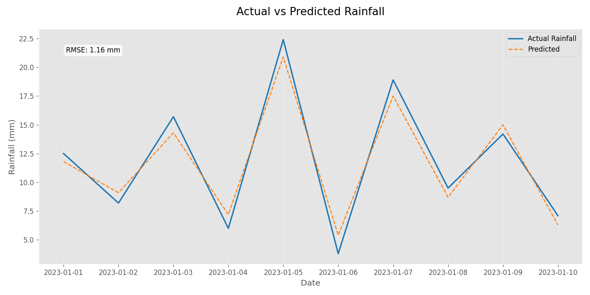
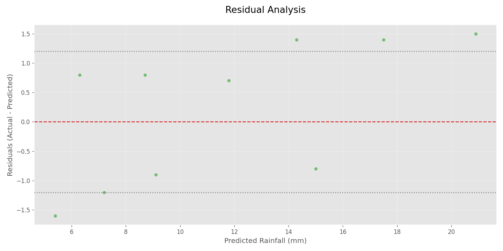
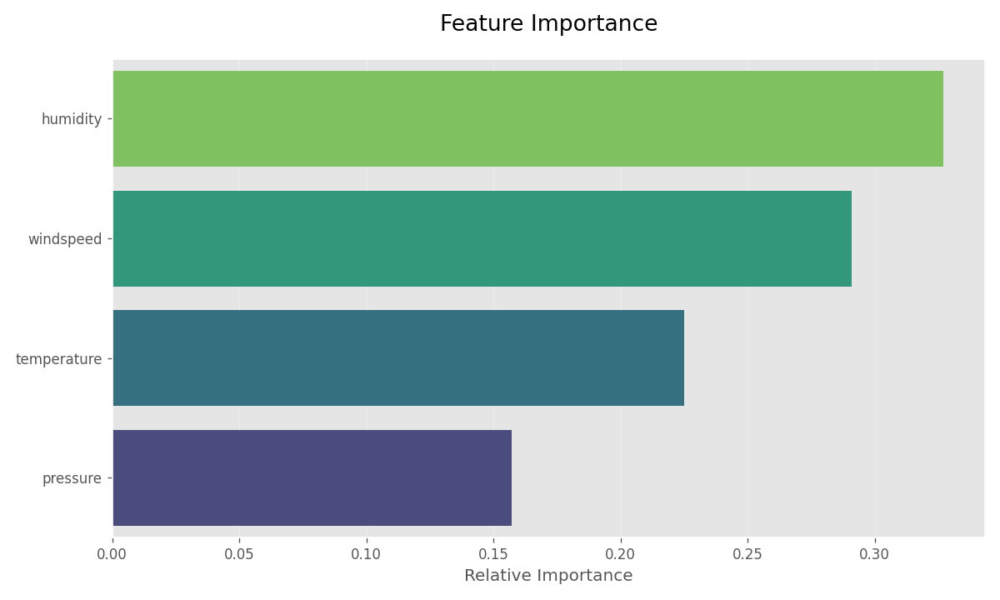

# 🌧️ Rainfall Prediction Visualizer



A professional-grade Python tool for visualizing and analyzing rainfall prediction model performance.

## ✨ Features

- **Multi-View Dashboard**:
  - 📈 Actual vs Predicted comparison
  - 📊 Residual analysis
  - 🔍 Feature importance
- **Smart Visualization**:
  - Automatic RMSE calculation
  - Interactive Plotly charts
  - Publication-ready PNG outputs
- **Error-Resistant Design**:
  - Works with or without model file
  - Generates sample data if needed
  - Clear error messaging

## 🚀 Quick Start

### Prerequisites
- Python 3.8+
- pip package manager

### Installation
```bash
git clone https://github.com/Kirankumarvel/RainfallVisualizer.git
cd RainfallVisualizer
pip install -r requirements.txt
```

### Basic Usage
1. **With your own data**:
   - Place prediction data in `data/predictions.csv`
   - Place model in `models/rainfall_model.pkl`

2. **Run the visualizer**:
   ```bash
   python visualize.py
   ```

3. **View results** in the `assets/` folder:
   - `predictions_plot.png`
   - `residuals_plot.png`
   - `feature_importance.png`
   - Interactive `predictions_interactive.html`

## 📂 Data Preparation

### Prediction Data Format (`data/predictions.csv`)
```csv
date,actual,predicted,temperature,humidity,pressure,windspeed
2023-01-01,12.5,11.8,22.1,78,1012.3,8.4
2023-01-02,8.2,9.1,24.5,65,1013.7,12.1
```

### Model Requirements
- scikit-learn compatible model (`.pkl` format)
- Should have `feature_importances_` attribute

## 🛠️ Customization

### Visualization Options
```python
# In visualize.py:
plt.style.use('ggplot')  # Change to 'seaborn', 'fivethirtyeight', etc.
rcParams['font.size'] = 12  # Adjust font sizes
```

### Algorithm Parameters
```python
# Modify RMSE calculation:
mse = mean_squared_error(actual, predicted)
rmse = np.sqrt(mse)  # Customize calculation as needed
```

## 📊 Output Examples

### 1. Prediction Comparison

- Time-series of actual vs predicted values
- RMSE score annotation
- Interactive HTML version available

### 2. Residual Analysis

- Shows prediction error distribution
- Highlights potential model bias
- Includes standard deviation lines

### 3. Feature Importance

- Identifies most influential features
- Helps with model interpretation
- Works with CSV or model-native importance

## 💡 Pro Tips

1. **For Better Visuals**:
   ```python
   # Increase DPI for publications
   plt.savefig('output.png', dpi=300)
   ```

2. **Add More Metrics**:
   ```python
   from sklearn.metrics import r2_score
   r2 = r2_score(actual, predicted)
   ```

3. **Compare Multiple Models**:
   - Duplicate the visualization code
   - Use different line styles/colors

## 🐛 Troubleshooting

| Issue | Solution |
|-------|----------|
| Missing model/file | Script will generate sample data |
| Visualization errors | Check for NaN values in data |
| Font warnings | Install missing system fonts |
| Plotly not working | `pip install plotly` |

## 🤝 Contributing

We welcome:
- Additional metrics (MAE, R²)
- New visualization types
- Model comparison features
- Enhanced interactivity

**Contribution Guide**:
1. Fork the repository
2. Create your feature branch
3. Submit a pull request

## 📜 License

MIT License - Free for academic and commercial use

---

**Research Tip**: Combine with [SHAP](https://github.com/slundberg/shap) for advanced model explainability! 🔍
